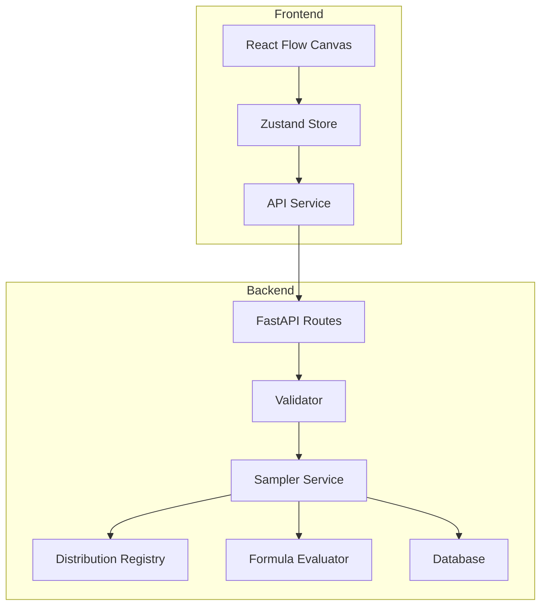

# Architecture Overview

This document describes the high-level architecture of Data Simulator, a tool for generating synthetic datasets from probabilistic Models.

## Core System Architecture

## 1. Backend: Data Generation Engine

The heart of the application is the `Sampler Service`. It transforms a DAG (Directed Acyclic Graph) definition into a tabular dataset.

### Sampling Methodology
- **Topological Sorting**: The DAG is sorted to identify dependencies. Nodes are generated in order (parents before children).
- **Vectorized Generation**: Whenever possible, nodes are generated using NumPy/Pandas vectorized operations for performance.
- **Sequential Evaluation**: If a node has "row-level" dynamic parameters (e.g., a distribution parameter that depends on a formula), the engine falls back to row-by-row evaluation using the `simpleeval` library safely.

### Distribution System
- **Registry**: A central registry manages built-in distributions (Normal, Bernoulli, etc.).
- **SciPy Integration**: Support for the full suite of `scipy.stats` distributions is provided via a wrapper.

### 1.3. Dual-Mapping Variable System
To ensure stability while maintaining user-friendliness, the backend implements a **dual-mapping** strategy for node variables:
- **Internal Storage**: Generated data is stored in memory indexed by **both** the Node ID and the `effective_var_name`.
- **Formulas**: Users can reference variables in formulas using either their snake_cased name (e.g., `base_salary`) OR their Node ID.
- **Backend Logic**: Stochastic parameter lookups (e.g., keys in `LookupValue`) primarily use Node IDs for stability.
- **Output**: The final DataFrame uses `effective_var_name` (snake_cased) for column names.

## 2. Frontend: Visual State Management

### Reactor Flow + Zustand
- **Single Source of Truth**: The `dagStore` (Zustand) manages the graph structure, node configurations, and edges as a unified state.
- **Immer Integration**: State mutations are handled via Immer to ensure immutability with clean syntax.
- **Sync with Backend**: The store handles automatic validation rounds and preview generation fetches.

## 3. Data Flow

1. **User Interaction**: User adds a node or edge in the React Flow canvas.
2. **State Update**: `dagStore` updates and triggers a validation call to the backend.
3. **Validation**: Backend checks for cycles and formula syntax.
4. **Sampling**: When "Generate" is clicked, the backend executes the sampling pipeline.
5. **Persistence**: Projects are saved to PostgreSQL (Supabase) via SQLAlchemy ORM.

---
> [!NOTE]
> The engine is designed to be extensible. New distribution types or custom formula functions can be added to the registry with minimal code changes.
