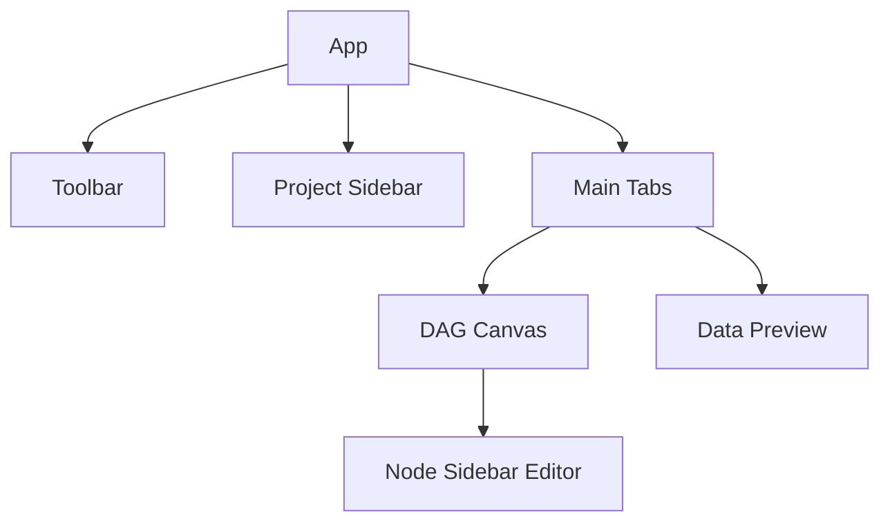

# Component Catalog

The Data Simulator frontend follows a modular architecture organized by feature area.

## UI Layout



## Core Components

### 1. Canvas (`/components/Canvas`)
- **DAGCanvas**: The main React Flow instance. Handles node/edge rendering, drag-and-drop, and selection.
- **CustomNode**: Specialized node component that reflects node status (valid/invalid) and kind (stochastic/deterministic).

### 2. Panel (`/components/Panel`)
- **NodeSidebar**: The primary editor for node configurations.
- **DistributionEditor**: Handles parameter configuration for different distribution types.
- **FormulaEditor**: A specialized text area with auto-completion for parent node names and context variables.

### 3. Preview (`/components/Preview`)
- **DataTable**: High-performance table for displaying generated preview rows.
- **StatsView**: Visual summary of distribution statistics for generated columns.

### 4. Toolbar (`/components/Toolbar`)
- **Actions**: Global actions like "Generate Data", "Validate DAG", and "Export".
- **ProjectInfo**: Displays the current project name and save status.

## Common Utilities (`/components/common`)
- **Input / Select**: Tailored components styled with TailwindCSS v4 for a consistent look.
- **Model / Drawer**: Low-level UI primitives for overlays.

---
> [!TIP]
> **State Integration**: Components are connected to the Zustand `dagStore`. Instead of prop-drilling, components use selective selectors:
> ```tsx
> const nodes = useDAGStore(state => state.nodes);
> ```
